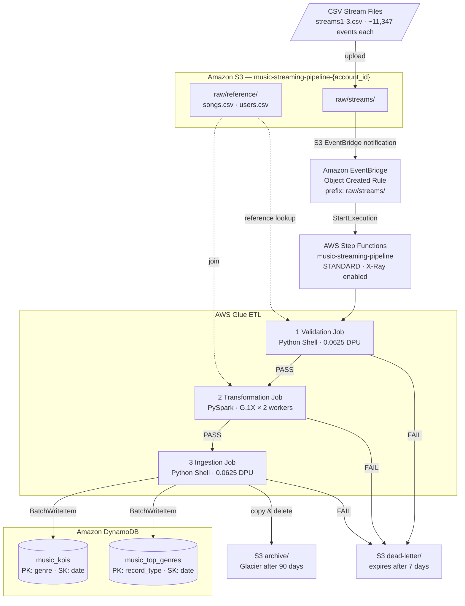
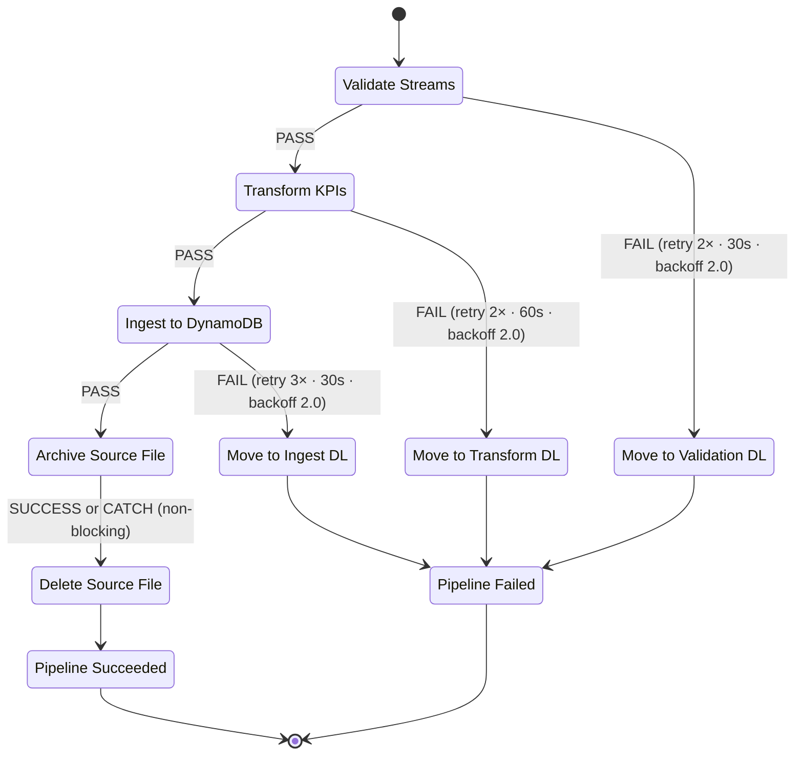
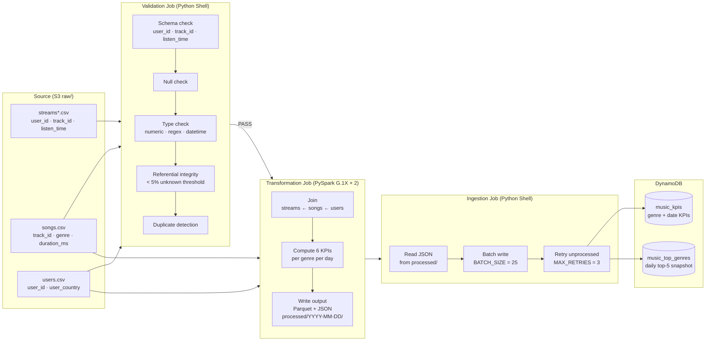
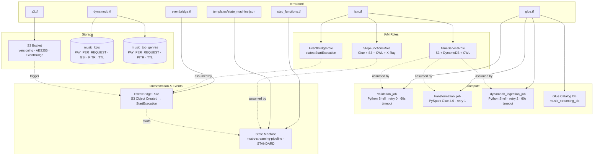
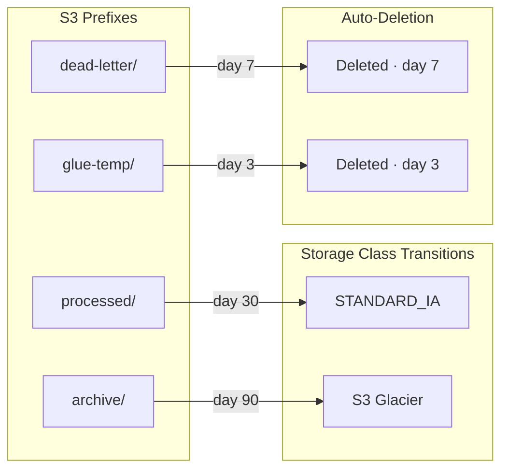

# Music Streaming Data Pipeline

>AWS data pipeline that processes user streaming events, computes daily genre-level KPIs, and stores results in DynamoDB. Orchestrated by Step Functions, transformed by AWS Glue, and fully provisioned with Terraform.

### High-Level Architecture



---

### Pipeline Orchestration

Step Functions state machine with per-stage retries and dead-letter routing.



### ETL Data Flow

How data moves through the three Glue jobs from raw CSV to DynamoDB items.



### Infrastructure Map (Terraform)



### S3 Lifecycle Rules




### Project Structure

```
AWSProject1/
├── data/                                   raw input files
│   ├── songs/
│   │   └── songs.csv                       89,742 tracks with audio features
│   ├── users/
│   │   └── users.csv                       50,001 user profiles
│   └── streams/
│       ├── streams1.csv                    ~11,347 streaming events each
│       ├── streams2.csv
│       └── streams3.csv
│
├── terraform/                              all infrastructure-as-code
│   ├── main.tf                             provider + account ID locals
│   ├── variables.tf                        input variable declarations
│   ├── outputs.tf                          resource ARNs printed after apply
│   ├── terraform.tfvars                    region, sizing, table names
│   ├── s3.tf                               bucket, versioning, SSE, lifecycle, script uploads
│   ├── iam.tf                              Glue / Step Functions / EventBridge IAM roles
│   ├── dynamodb.tf                         music_kpis + music_top_genres + GSI + TTL
│   ├── glue.tf                             Glue catalog DB + 3 job definitions
│   ├── step_functions.tf                   state machine + CloudWatch log group
│   ├── eventbridge.tf                      S3 trigger rule -> Step Functions target
│   └── templates/
│       └── state_machine.json              ASL definition (rendered by Terraform templatefile)
│
├── glue_jobs/                              Glue job scripts (uploaded to S3 by Terraform)
│   ├── validation_job.py                   Python Shell: schema, nulls, types, referential integrity
│   ├── transformation_job.py               PySpark: join streams+songs+users, compute 6 KPIs
│   └── dynamodb_ingestion_job.py           Python Shell: JSON -> DynamoDB batch write
│
├── scripts/
│   ├── setup.py                            pre-flight check: Python, Terraform, AWS CLI, credentials
│   └── upload_data.py                      seed S3 with reference data + stream files
│
├── docs/
│   └── 2--ETL with s3, dynamo and Glue [updated].docx   project specification
│
├── .gitignore
├── requirements.txt                        boto3, pandas, pyarrow
└── README.md
```

### S3 Bucket Layout

```
music-streaming-pipeline-<account_id>/
├── raw/
│   ├── streams/                    <-- drop CSV files here to trigger the pipeline
│   └── reference/
│       ├── songs/
│       └── users/
├── processed/
│   └── <YYYY-MM-DD>/
│       ├── genre_kpis/
│       │   ├── parquet/            analytical archive
│       │   └── json/               interface for DynamoDB ingestion
│       ├── top_genres/
│       │   ├── parquet/
│       │   └── json/
│       └── reports/                validation + ingestion JSON summaries
├── archive/                        processed stream files (Glacier transition after 90 days)
├── dead-letter/                    failed files, auto-deleted after 7 days
│   ├── validation-errors/
│   ├── transform-errors/
│   └── ingest-errors/
├── glue-scripts/                   job scripts (managed by Terraform)
└── glue-temp/                      Spark shuffle + logs (deleted after 3 days)
```


### DynamoDB Tables

#### `music_kpis` — per-genre, per-day KPIs

| Key | Attribute | Type | Notes |
|-----|-----------|------|-------|
| PK  | `genre`   | S    |       |
| SK  | `date`    | S    | YYYY-MM-DD |
|     | `listen_count` | N | |
|     | `unique_listeners` | N | |
|     | `total_listen_time_ms` | N | |
|     | `avg_listen_time_ms` | N | |
|     | `top_3_songs` | S | JSON list |
|     | `processed_at` | S | ISO 8601 |
|     | `ttl_expiry` | N | Unix epoch, 90-day TTL |

**GSI `date-index`**: PK = `date`, SK = `listen_count` — enables top-5 genres query sorted by listen count.

#### `music_top_genres` — daily top-5 snapshot (O(1) lookup)

| Key | Attribute | Type | Notes |
|-----|-----------|------|-------|
| PK  | `record_type` | S | Always `"TOP_GENRES"` |
| SK  | `date` | S | YYYY-MM-DD |
|     | `top_5_genres` | S | JSON ordered list |
|     | `processed_at` | S | ISO 8601 |
|     | `ttl_expiry` | N | 90-day TTL |

Both tables use **PAY_PER_REQUEST** billing and have **PITR** enabled.

### KPIs Computed

| KPI | Granularity | Target Table |
|-----|-------------|--------------|
| Listen count | per genre per day | `music_kpis` |
| Unique listeners | per genre per day | `music_kpis` |
| Total listening time (ms) | per genre per day | `music_kpis` |
| Average listening time per user (ms) | per genre per day | `music_kpis` |
| Top 3 songs | per genre per day | `music_kpis` |
| Top 5 genres | per day | `music_top_genres` |


### Setup & Deployment

#### 1. Check your machine

```bash
python scripts/setup.py
```

Verifies Python >= 3.9, Terraform >= 1.5, AWS CLI, and live AWS credentials. Installs Python dependencies automatically.

#### 2. Deploy infrastructure

```bash
cd terraform
terraform init
terraform plan    # review what will be created
terraform apply   # provision everything in AWS
cd ..
```

#### 3. Seed reference data

```bash
python scripts/upload_data.py --reference-only
```

Uploads `songs.csv` and `users.csv` to `raw/reference/` in S3.

#### 4. Run the pipeline

```bash
# Upload one stream file — EventBridge fires and Step Functions starts
python scripts/upload_data.py --streams-only --file streams1.csv

# Upload all 3 files (triggers 3 separate executions)
python scripts/upload_data.py --streams-only
```

#### 5. Monitor

```
AWS Console -> Step Functions -> music-streaming-pipeline -> Executions
AWS Console -> CloudWatch    -> Log groups -> /aws/states/music-streaming-pipeline
AWS Console -> CloudWatch    -> Log groups -> /aws-glue/jobs/music-streaming-pipeline
```

#### Tear down

```bash
cd terraform
terraform destroy
```

Deletes every AWS resource and empties the S3 bucket. Costs stop immediately.

### DynamoDB Query Examples

```python
import boto3, json
from boto3.dynamodb.conditions import Key

dynamodb = boto3.resource("dynamodb")
kpis     = dynamodb.Table("music_kpis")
top      = dynamodb.Table("music_top_genres")

# All KPIs for genre "pop" on a specific date
item = kpis.get_item(Key={"genre": "pop", "date": "2024-06-25"})["Item"]

# Trend: all dates for genre "rock"
rows = kpis.query(KeyConditionExpression=Key("genre").eq("rock"))["Items"]

# Top 5 genres on a date, sorted by listen count (GSI)
rows = kpis.query(
    IndexName="date-index",
    KeyConditionExpression=Key("date").eq("2024-06-25"),
    ScanIndexForward=False,
    Limit=5,
)["Items"]

# Pre-computed top-5 snapshot (single item lookup)
snapshot = top.get_item(Key={"record_type": "TOP_GENRES", "date": "2024-06-25"})["Item"]
print(json.loads(snapshot["top_5_genres"]))

# Genre KPI for a date range
rows = kpis.query(
    KeyConditionExpression=Key("genre").eq("acoustic") & Key("date").between("2024-06-01", "2024-06-30")
)["Items"]
```

---

### Troubleshooting

| Symptom | Fix |
|---------|-----|
| Pipeline not triggered after upload | Run `terraform apply` first — S3 EventBridge notifications must be enabled |
| Glue job `AccessDenied` | Re-run `terraform apply` — IAM changes take ~30s to propagate |
| `UnprocessedItems` in DynamoDB logs | Normal under burst load — the job retries automatically |
| Step Functions `PipelineFailed` | Check `dead-letter/` prefix in S3 and CloudWatch Glue job logs |
| `terraform destroy` fails on S3 | Ensure `force_destroy = true` is set in `terraform/s3.tf` |
| Transformation job OOM | Increase `glue_num_workers` in `terraform.tfvars` and re-apply |
